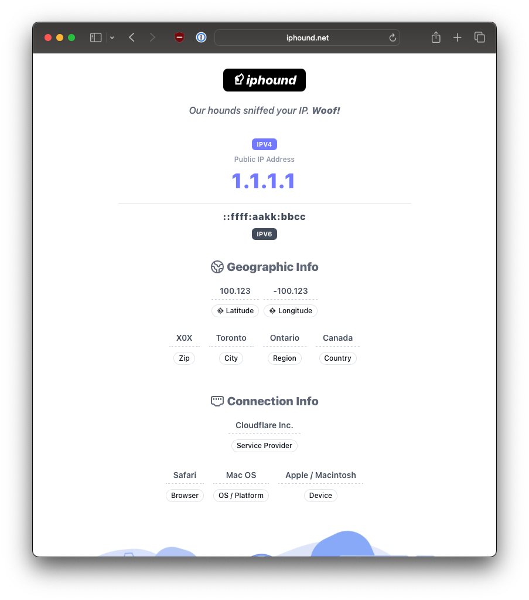

<div align="center">

# iphound.net

Repository for the open source IP lookup and geolocation service at https://iphound.net

</div>



### Table of Contents

- [Setup Development Environment](#setup-development-environment)
- [Webserver Configuration (Caddyfile)](#webserver-configuration-caddyfile)
- [Usage & APIs](#usage)
  - [CLI Usage](#cli-usage)
  - [API Usage](#api-usage)
  - [API Responses](#api-responses)
  - [API Rate Limiting](#api-rate-limiting)

### Setup Development Environment

This service is built with NextJS (+ Tailwind) as a fullstack app. on Node v24.

```bash
git clone git@github.com:cgons/iphound.net.git
---
npm install
npm run dev
```

Note:

- This service is hosted behind Cloudflare.
- During develpment/testing, IVP4 addresses can be specified in [`.env.development`](https://github.com/cgons/iphound.net/blob/master/.env.development)
  - Set `DEV_MODE_IP=true` and `DEV_IPV4=1.1.1.1`.
- In production, the real IP address is read from a Cloudflare set header: [`CF-Connecting-IP`](https://developers.cloudflare.com/fundamentals/reference/http-headers/#cf-connecting-ip)

#### Webserver Configuration (Caddyfile)

In order for the project specific ([iphound.Caddyfile](https://github.com/cgons/iphound.net/blob/master/iphound.Caddyfile)) Caddyfile to work as expected, it needs to be included into a parent or global Caddyfile that properly defines trusted proxies as shown below.

```caddyfile
{
	servers {
		# Trusted Proxy Configuration
		# ---
		# Using https://github.com/WeidiDeng/caddy-cloudflare-ips to keep Cloudflare IPs updated automatically
		trusted_proxies cloudflare {
			interval 12h
			timeout 15s
		}
		trusted_proxies_strict

		# Since we're behind Cloudflare, use the CF header first and then the standard X-Forwarded-For
		client_ip_headers CF-Connecting-IP X-Forwarded-For
	}
}
```

### Usage & APIs

#### CLI Usage

You can quickly get your public IP by making a call to iphound.net:
```bash
curl iphound.net
1.1.1.1
```
This public IP is pulled directly from the incoming http request by the webserver (Caddy) so it's very fast and efficient.

#### API Usage

If you're looking for geographic information about your ip address, a simple JSON endpoint is avaiable.

API URL: `https://iphound.net/ip`

Params:
- geo = `true`, `t`, `1`

#### API Responses
```bash
# Fetch your public IP address
curl -s 'https://iphound.net/api/ip'
{
  "ipaddress": "162.159.134.22"
}

# -----------------------------------

# Fetch your public IP address with geo. data
curl -s 'https://iphound.net/api/ip?geo=true'
{
  "ipaddress": "162.159.134.22",
  "country_name": "United States",
  "country_iso_code": "CA",
  "subdivision": "California",
  "city_name": "San Francisco",
  "postal_code": "94107",
  "latitude": 37.7749,
  "longitude": -122.4194,
  "asn": {
    "asn_number": 13335,
    "asn_org": "Cloudflare, Inc."
  }
}

# -----------------------------------

# Lookup info. for a specific IP address
curl -X POST https://iphound.net/api/ip/lookup \
-H 'Content-Type: application/json' \
-d '{"ip":"8.8.8.8"}'
{
  ... same response as above ...
}
```

Tip: For quick testing in the terminal, pipe the output to [jq](https://github.com/jqlang/jq) - `curl -s 'iphound.net/ip?geo=true' | jq`

#### API Rate Limiting

As this is a free service, API requests are throttled to a couple requests per second (per IP). 
See [rate limiting config.](https://github.com/cgons/iphound.net/blob/3df043f6b9521a90531993a1f5a898475c405042/iphound.Caddyfile#L60) for more details

```bash
# 10 req/s | 5 concurrent tasks | for 10 seconds
# ---
hey -q 10 -c 5 -z 10s 'http://iphound.net/ip?geo=t'

Summary:
  Total:	10.0513 secs
  Slowest:	0.2333 secs
  Fastest:	0.0409 secs
  Average:	0.0527 secs
  Requests/sec:	49.5461

Response time histogram:
  0.041 [1]	|
  0.060 [414]	|■■■■■■■■■■■■■■■■■■■■■■■■■■■■■■■■■■■■■■■■
  0.079 [48]	|■■■■■
  0.099 [27]	|■■■

... details truncated ...

Status code distribution:
  [200]	60 responses
  [429]	438 responses
```
Rate limit testing was conducted with `hey` - https://github.com/rakyll/hey
